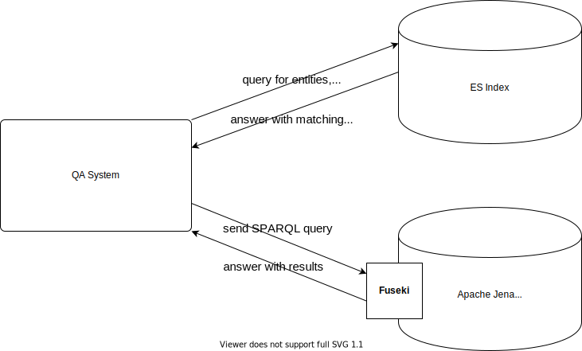

# qa-system

A Question and Answering system for the DCAT vocabulary developed 

A Spring Boot application that:
  - implements a question and answering system for the dcat vocabulary
  - provides a rest endpoint for sending questions
  
## Requirements

  - elastic search instance for entity recognition
  - sparql endpoint for querying data

## Overview of the Architecture

## API

see [API Documentation](docs/api.md)

## Build

Prerequisites:
  - maven
  - jdk 11

Run

    mvn clean package -DskipTests

to build jar

## Build Docker

The docker container can only be built if before the application was build with maven.

Run

    docker build -t qa-system .

to build a docker image

## Environment Variables

In general, all values from the `application.yml` can be overwritten by environment variables.
The following environment variables have to be set to overwrite the default values in the `application.yml`.

| variable         | default | example                          | description                                                                                                             |
| ---------------- | ------- | -------------------------------- | ----------------------------------------------------------------------------------------------------------------------- |
| `ES_HOST`           | localhost    | https://openbot.cs.upb.de/es                             | defines the port where the web interface should be delivered.                                                           |
| `ES_PORT`       | 3000      | 9200                              | defines in which language the bot responds but not the language in which questions can be asked.                        |
| `SPARQL_ENDPOINT`         |      https://openbot.cs.upb.de/fuseki    | https://openbot.cs.upb.de/fuseki     | the URL of the Apache Jena Fuseki instance, that is used to execute the SPARQL queries                                                                 |
| `SPARQL_QUERYPATH`     |    /opal2020-07/query     |/opal2020-07/query | path of the query endpoint of the fuseki instance |
| `DATA_DIR` |    src/data     |      /qa/data                 | path to the directory with labeled entities, properties, etc. |

## Run Docker

Run

    docker run -p 8080:8080 -e DATA_DIR=/qa/data qa-system

or use provided `docker-compose.yml`

## Run Locally

Prerequisites:
  - jdk/jre 11
  - elastic search index
  - apache jena fuseki triplestore holding data described with the dcat vocabulary

set env variables and

Run

    java -jar target/dcat-qa-system-1.0.0.jar

the rest endpoint should then be available under `http://localhost:8080/qa`

questions can be sent, for example, with curl:

    curl -G --data-urlencode "question=Which formats are available?" localhost:8080/qa

