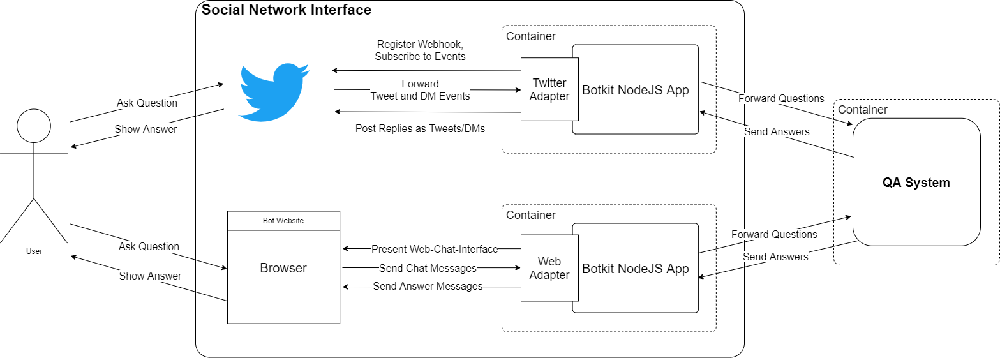
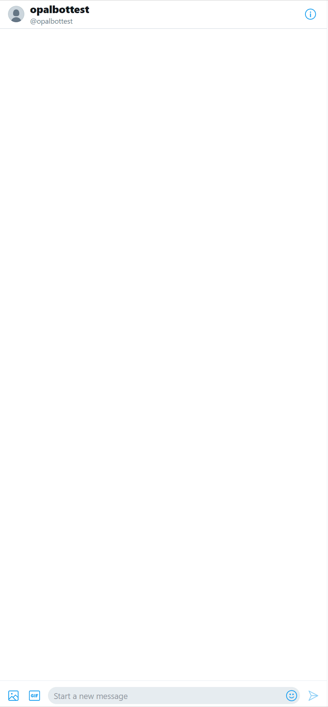
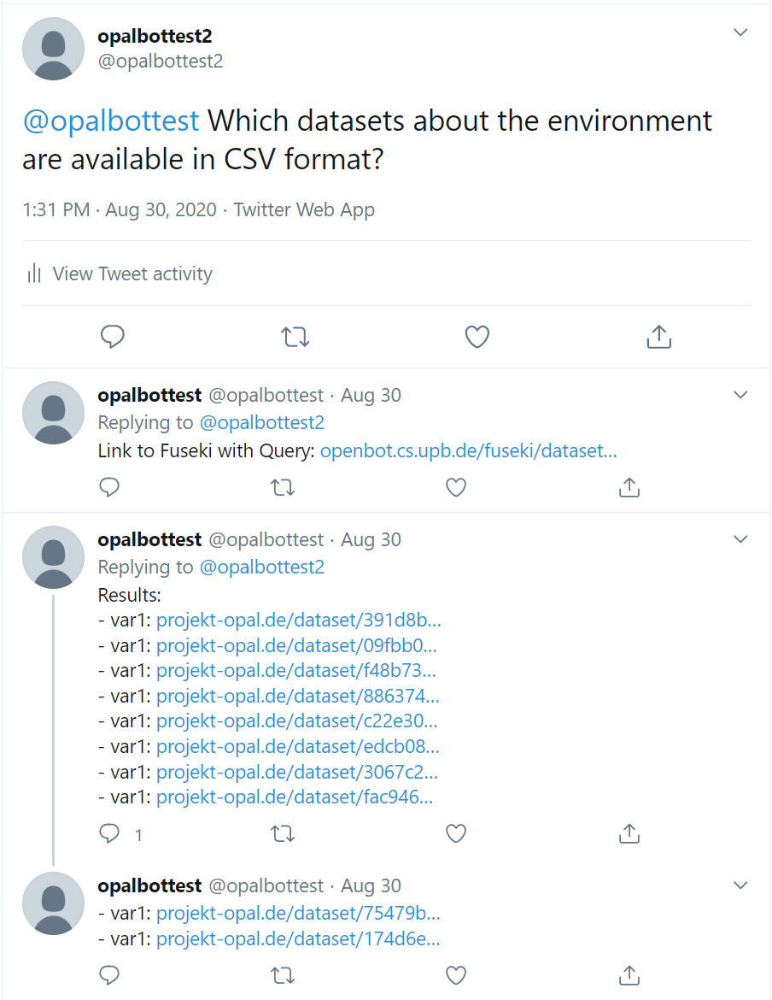

# Twitter Bot

This project implements a chatbot connected to Twitter that provides a conversational interface for the DCAT QA system. It was developed as part of the bachelorthesis "A Question Answering (QA) System for the Data Catalog Vocabulary (DCAT)".

In particular the project consists of a nodejs app that:
- subscribes to Twitters account-activity api
- consumes all tweets and direct messages from twitter
- uses botkit to manage conversations and implement all dialogs
- passes all questions to the specified QA system endpoint
- presents the results from the QA system to the user

The Twitter bot is a part of the social network interface for the DCAT QA system. The following shows an overview of all components of the interface and how they communicate:



More info on the implementation details can be found in the [thesis](https://git.cs.uni-paderborn.de/martenls/bachelor-thesis/-/blob/dev/thesis/thesis.pdf).

## Twitter Bot Direct Message Demo



## Twitter Bot Tweet Demo



## Twitter Bot Live Demo

Tweet at or send a direct message to [@opalbottest](https://twitter.com/opalbottest).

## Build Docker


Build yourself with (run in `twitter-bot` folder)
```
docker build  -t sninterface-twitter .
```
 or pull from gitlab container registry with 
```
docker login hub.cs.upb.de
docker pull hub.cs.upb.de/martenls/bachelor-thesis-code/sninterface-twitter
```

## Run

### Environment Variables

The app depends on multiple environment variables to work properly.
These can be set manually or provided with a `.env` file.

#### OAuth:

Set access tokens from the twitter account that should be subscribed to.

Get Tokens: 
- Generate keys with a twitter developer account under https://developer.twitter.com/en/apps/ -> Keys and Tokens
- allow access to direct messages under -> Permissions
```
TWITTER_CONSUMER_KEY=***********
TWITTER_CONSUMER_SECRET=***********
TWITTER_ACCESS_TOKEN=***********
TWITTER_ACCESS_TOKEN_SECRET=***********
```

#### Webhook Config

| variable              | default | example                       | description                                                                                 |
| --------------------- | ------- | ----------------------------- | ------------------------------------------------------------------------------------------- |
| `TWITTER_WEBHOOK_ENV` |         | dev                           | Name of the environment defined under https://developer.twitter.com/en/account/environments |
| `WEBHOOK_URL`         |         | https://62974cfbed25.ngrok.io | base of the url where the webook is hosted                                                  |
| `WEBHOOK_URI`         | /       | /sninterface/twitter/webhook/ | path to where the webhook is hosted, default "/"                                            |
| `PORT`                | 3000    | 3333                          | port where the webhook will listen, default:3000                                            |


#### General Config


| variable         | default | example                          | description                                                                                                             |
| ---------------- | ------- | -------------------------------- | ----------------------------------------------------------------------------------------------------------------------- |
| `BOT_LANG`       | en      | de                               | defines in which language the bot responds but not the language in which questions can be asked.                        |
| `QA_URL`         |         | http://localhost:8080/qa         | sets the URL the bot sends the questions to                                                                             |
| `FUSEKI_URL`     | /       | https://openbot.cs.upb.de/fuseki | sets the URL of the Apache Jena Fuseki instance, that is used to provide links for receiving all results for a question |
| `FUSEKI_DATASET` |         | opal2020-07                      | sets the name of the dataset used to build the links                                                                    |


### Locally

Prerequisites:
  - node
  - npm

Run in `twitter-bot` directory:


install dependencies

    npm install ngrok -g
    npm run build-adapter
    npm install

run ngrok for webhook endpoint

    ngrok http 3000

copy to local dir and fill out env template `.env-templates/twitter.env`

run app

    node bot.js

### Docker


```
docker run --name sninterface-twitter -p 3000:3000 --env-file twitter.env sninterface-twitter
```

or use provided `docker-compose.yml`


