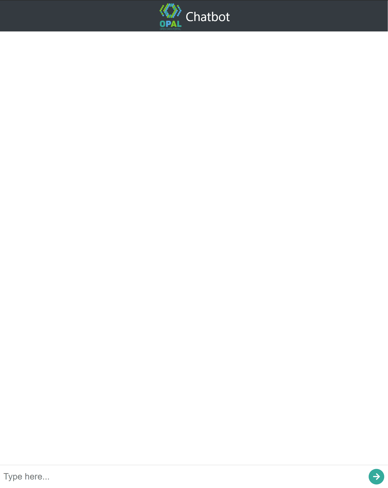

# Web Bot

A nodejs app that:
 - provides a web chat interface
 - implements introductory dialogs
 - passes questions to the qa-system
 - replies with formatted results fetched from qa-system
  

## Demo of the Web Bot



## Build Docker

Build yourself with (run in `web-bot` folder)
```
docker build -t sninterface-web .
```
 or pull from gitlab container registry with 
```
docker login hub.cs.upb.de
docker pull hub.cs.upb.de/martenls/bachelor-thesis-code/sninterface-web
```

## Run

### Environment Variables

| variable         | default | example                          | description                                                                                                             |
| ---------------- | ------- | -------------------------------- | ----------------------------------------------------------------------------------------------------------------------- |
| `PORT`           | 3000    | 3030                             | defines the port where the web interface should be delivered.                                                           |
| `BOT_LANG`       | en      | de                               | defines in which language the bot responds but not the language in which questions can be asked.                        |
| `QA_URL`         |         | https://openbot.cs.upb.de/qa     | the URL of the qa system the bot sends the questions to                                                                 |
| `FUSEKI_URL`     |         | https://openbot.cs.upb.de/fuseki | sets the URL of the Apache Jena Fuseki instance, that is used to provide links for receiving all results for a question |
| `FUSEKI_DATASET` |         | opal2020-07                      | sets the name of the dataset used to build the links                                                                    |

A template can be found in the `.env-templates` folder.

### Locally

Prerequisites:
  - node
  - npm

Run in `web-bot` directory:

install dependencies

    npm install

run app

    node bot.js

### Docker

pass env variables via file:

```
docker run --name sninterface-web -p '3030:3030' --env_file .env sninterface-web
```

or use provided `docker-compose.yml`